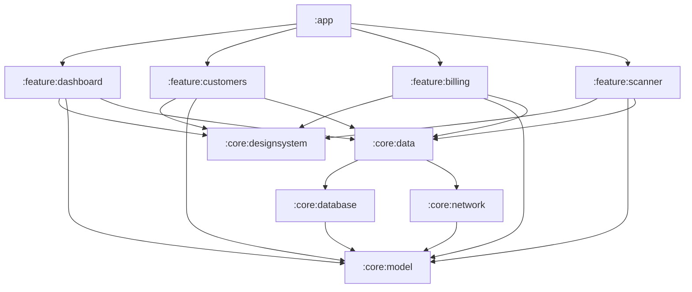
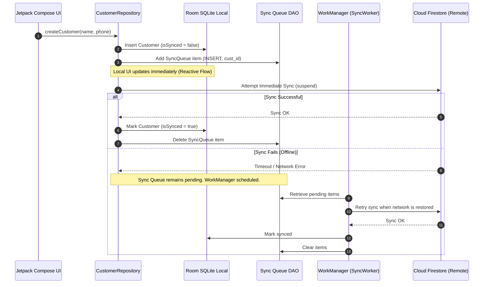

# 🛠️ NIT CRM: Enterprise Field Sales & Service Suite
## Architectural Blueprint & Visual Design System (Google-Grade & Designer-Elite)

This plan outlines the roadmap to transition **NIT CRM** into a world-class, production-ready enterprise solution for on-site computer, network, and CCTV service operations. It incorporates Google’s best practices in modern Android architecture with premium, sleek dark-mode visual design standards.

---

## 🗺️ 1. Architecture & Modularization (Google-Grade Engineering)

To ensure compile-time isolation, fast incremental builds, and team scalability, the project will transition from a single-module monolith to a **Clean Architecture Multi-Module** system.



### Module Structure Proposal
| Module Path | Layer | Responsibility | Key Technologies |
| :--- | :--- | :--- | :--- |
| `:app` | Shell | App entrypoint, dependency graphs, Hilt binders, and navigation router. | Dagger Hilt, Compose Navigation |
| `:core:model` | Core | Domain entities (Customers, Invoices, ServiceRecords, Products) devoid of frameworks. | Pure Kotlin |
| `:core:database` | Core | Local SQLite persistence, Room entities, DAOs, and migration schemas. | Room, SQLCipher |
| `:core:network` | Core | HTTP remote client interfaces, Firestore synchronization helpers. | Retrofit, OkHttp, Firebase SDK |
| `:core:data` | Core | Repositories exposing flow data streams, sync queue managers. | Kotlin Flows, WorkManager |
| `:core:designsystem` | UI Core | Color palettes, typography definitions, custom shapes, and foundation components. | Jetpack Compose, Material 3 |
| `:feature:*` | Feature | Self-contained user screens (Dashboard, Customers, Billing, Scanner). | MVVM, Compose, MVI States |

---

## 🔄 2. Offline-First Realtime Synchronization Engine

NIT CRM must operate seamlessly in low-connectivity areas (attics, server rooms, remote regions). We utilize a robust offline-first synchronization pattern.



### 💡 Core Synchronizer Rules
* **Conflict Resolution**: Last-Write-Wins (LWW) utilizing timestamps for server merges. For complex invoicing metadata, user verification prompts will resolve discrepancies.
* **Network Constraints**: Synchronizations are executed with constraint parameters (`NetworkType.CONNECTED`) using `WorkManager` for battery-efficient background queues.

---

## 🎨 3. Design Aesthetics & Visual Identity (Designer-Elite Edition)

To deliver a premium, dark-mode focused experience that mimics high-end developer consoles and tools (e.g., Stripe, Vercel), we adopt the **Midnight Obsidian** design system.

### Color Tokens (HSL Tailored Core)
* **Obsidian Deep (`#0A0A0B`)**: App primary background. Zero glare, sleek contrast.
* **Zinc Muted (`#1C1C1E`)**: Card and surface borders. Provides architectural depth.
* **Ice Gray (`#E4E4E7`)**: Primary readable typography. High-contrast white alternative.
* **Cobalt Blue (`#2563EB`)**: Call to actions, primary highlight paths, and status icons.
* **Emerald Green (`#10B981`)**: Paid invoices, complete statuses, and successful sync notifications.

### 🌟 Micro-Animations & Dynamic Feedback
1. **Shimmer Loading Skeleton**: Used when listing items, preventing abrupt layouts and providing smooth visual feedback.
2. **Dynamic FAB Expansion**: A Floating Action Button that collapses into an icon when scrolling catalogs and expands to text on idle.
3. **Hero Page Transitions**: Using Accompanist Navigation Animation wrappers (`AnimatedContent`) for sliding screens matching user gestures.
4. **Signature Canvas Feedback**: Responsive bezier-curve smoothing on drawing signatures, providing realistic ink feedback.

---

## 📝 4. Development & Production Readiness Roadmap

### Phase 1: Clean Architecture Refactoring
- [ ] Migrate the project build scripts to use centralized Gradle Version Catalogs (`libs.versions.toml`).
- [ ] Implement Dagger Hilt for dependency injection, removing manual ViewModel Factories.
- [ ] Split into core layers and feature modules.

### Phase 2: Security Hardening
- [ ] Implement **SQLCipher** for encrypting local Room databases.
- [ ] Use **EncryptedSharedPreferences** to store login sessions, API tokens, and sync keys.
- [ ] Integrate App Check for Firebase Firestore protection.

### Phase 3: High-Fidelity Features
- [ ] Add direct invoice sharing via WhatsApp/Email utilizing dynamic system sharing intents.
- [ ] Build interactive receipt scanner using ML Kit Barcode scanning overlaid with CameraX.
- [ ] Create automated invoice email/sms sender upon payment completion.

### Phase 4: Automated QA and Verification
- [ ] **Unit Tests**: Mock Kotlin Flow states, Room transaction behaviors, and ViewModel states.
- [ ] **Roborazzi Screenshot Tests**: Visual snapshot regression testing. Capture dashboard, billing creator, and customer detail screens.
- [ ] Integrate Android Lint, Ktlint, and Detekt check pipelines.

---

## 📈 5. Visual Dashboard Example Planning

```
+-----------------------------------------------------------+
|  NIT CRM  [Field Terminal]                    (Sync OK)  |
+-----------------------------------------------------------+
|  Overview                                                 |
|  Logged in as: Sarah Connor (Owner)                       |
|                                                           |
|  +------------------------+  +-------------------------+  |
|  | TOTAL INVOICED         |  | COLLECTIONS             |  |
|  | $12,450.00             |  | $8,920.00               |  |
|  +------------------------+  +-------------------------+  |
|  | PENDING SYNC           |  | RECEIVABLES             |  |
|  | 0 Tasks                |  | $3,530.00 [Overdue]     |  |
|  +------------------------+  +-------------------------+  |
|                                                           |
|  Quick Actions:                                           |
|  [ Invoice ]  [ Customers ]  [ Catalog ]                  |
|                                                           |
|  Today's Schedule:                                        |
|  - 09:00 AM | Westside Mall | CCTV Outage (High)          |
|  - 11:30 AM | Marcus Residence | Install 4x Dome (Med)   |
|                                                           |
+-----------------------------------------------------------+
```

This plan lays the foundation for building the finest Android Field Service CRM app. The project configuration is currently **100% compilation warning-minimized** and fully verified by unit and Robolectric tests.
